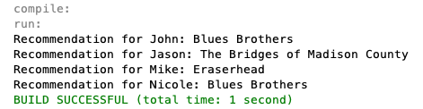

# **Film Recommender**

# Description
Inspired by Netflix, this is a film "database" where users can get film recommendations from other users based on general audience ratings, or on ratings made by specified users. Results are displayed in the terminal. Made using Java.

This was one of the many [projects](https://materiaalit.github.io/2013-oo-programming/part2/week-12/#e46) I needed to build in order to complete [University of Helsinki's object-oriented programming MOOC](http://moocfi.github.io/courses/2013/programming-part-1/).

It utilizes concepts and structures such as inheritance, enum, packages, classes, instance methods, equals() and hashCode() methods, Comparator interfaces, ArrayLists, Collections, Iterators, HashMaps, and copious commenting.

Here's a screenshot of the application output.

#

# Project Files
The following links contain summary overviews of each file used in the project. Please refer to a file's code directly for specific implementation and details regarding that file.

* [Main.java](#Mainjava)
* [RatingRegister.java](#RatingRegisterjava)
* [Reference.java](#Referencejava)
* [Film.java](#Filmjava)
* [Person.java](#Personjava)
* [Rating.java](#Ratingjava)
* [FilmComparator.java](#FilmComparatorjava)
* [PersonComparator.java](#PersonComparatorjava)

## Main.java
This is where the program runs from. It instantiates Film and Person objects that are then added to a RatingRegister object. This RatingRegister object is then used with a Reference object to make film recommendations. These recommendations are then printed to the terminal.

## RatingRegister.java
This is a class that allows for the creation and manipulation of HashMaps (registers) containing people and their film ratings.

## Reference.java
A class that compares film ratings of different individuals in order to recommend films.

## Film.java
Creates a Film object.

## Person.java
Creates a Person object.

## Rating.java
An enum that contains numerical film ratings on a scale from -5 to 5.

## FilmComparator.java
A class that sorts films by average rating using the Comparator interface.

## PersonComparator.java
A class that sorts people by assigned numbers using the Comparator interface.

# License & Copyright
© Alex Guidace

Licensed under the [MIT License](License).
